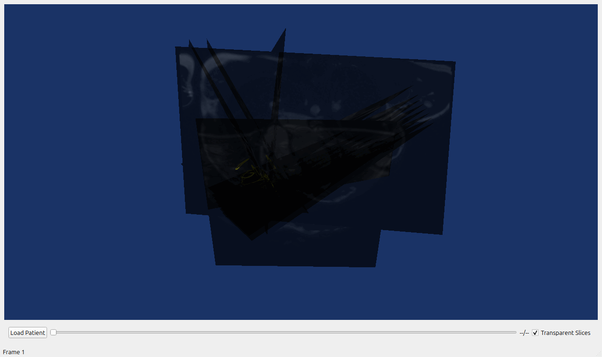
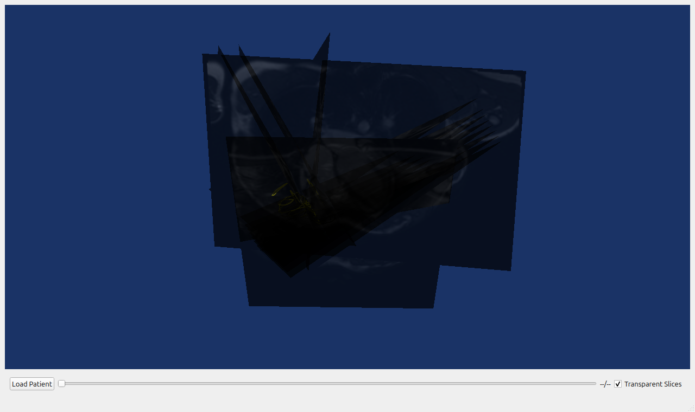
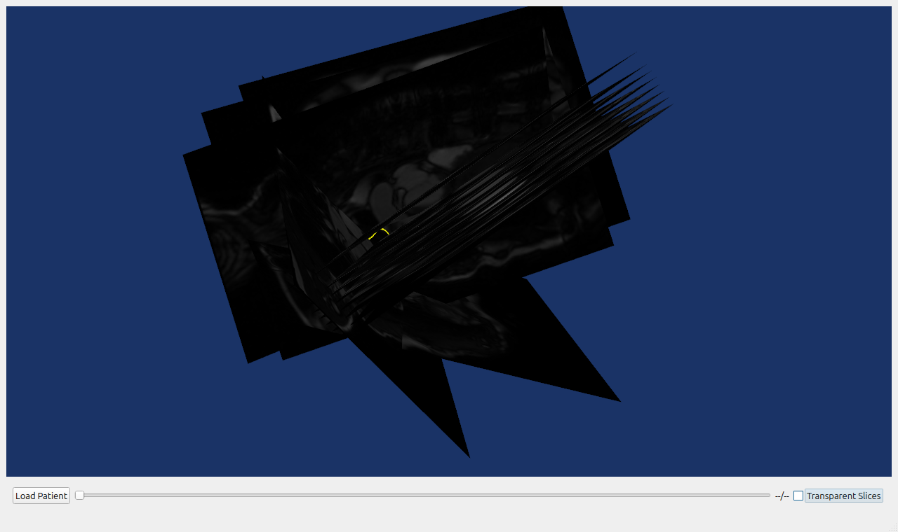

# 3D DICOM visualizer in C++

A DICOM viewer application built with Qt, VTK, and DCMTK.


*13 SA slices · 25 cardiac phases · RV contours — `sample_data/AB_20210818`*

## Features
- Load and view DICOM series
- Display associated contour data
- Adjustable transparency for slice viewing
- Time series navigation

## Screenshots

| Loaded (transparent) | Mid-phase | Opaque |
|---|---|---|
|  |  |  |

<details>
<summary>Previous sample images</summary>


</details>

## Building

Requires CMake, a C++17 compiler, Qt5, VTK 9, DCMTK, and Eigen3.

```bash
sudo ./scripts/setup-deps.sh   # Qt5, DCMTK, Eigen3, X11/GL headers
./scripts/build-vtk.sh         # pinned VTK 9.3.1 (~15 min, no root)

mkdir -p build && cd build
cmake ..
cmake --build .
```

## Running

The executable is `build/DicomViewer`. Launch it and click **Load Patient**
to pick a patient directory, or pass one directly:

```bash
./DicomViewer
./DicomViewer sample_data/AB_20210818
```

If rendering fails (no working OpenGL drivers), fall back to software rendering:

```bash
LIBGL_ALWAYS_SOFTWARE=1 ./DicomViewer
```

A synced sample patient is kept in `sample_data/` (gitignored — it contains
real medical images). Point the load dialog there for a ready-to-view dataset.


